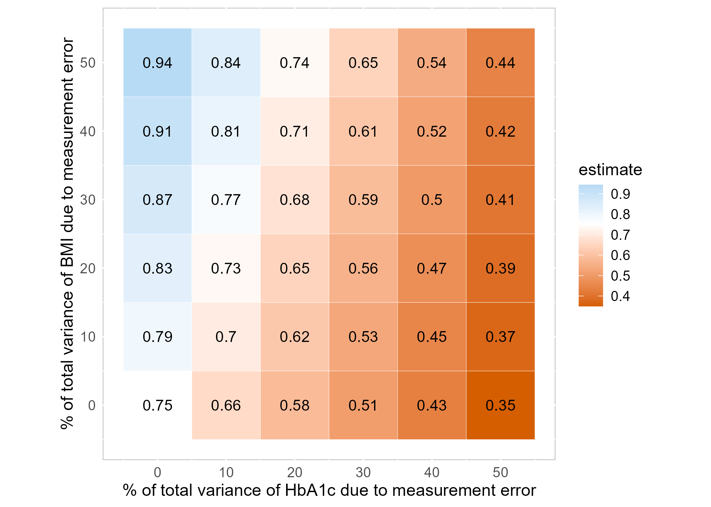

This document aims to reproduce the simulation study 'Introduction to statistical simulations in health research' by [@boulesteixIntroductionStatisticalSimulations2020].


```{r}
#load packages
#| echo: false
#| output: false
library(Hmisc)
library(mice)
library(tidyverse)
```

## Data prep

The different data sets are being loaded: 

```{r}
#| echo: true
#| output: false
d1 <- sasxport.get("DEMO_I.xpt")
d2 <- sasxport.get("BPX_I.xpt")
d3 <- sasxport.get("BMX_I.xpt")
d4 <- sasxport.get("GHB_I.xpt")
d5 <- sasxport.get("TCHOL_I.xpt")
d1.t <- subset(d1,select=c("seqn","riagendr","ridageyr"))
d2.t <- subset(d2,select=c("seqn","bpxsy1"))
d3.t <- subset(d3,select=c("seqn","bmxbmi"))
d4.t <- subset(d4,select=c("seqn","lbxgh"))
d5.t <- subset(d5,select=c("seqn","lbdtcsi"))
d1.t <- subset(d1,select=c("seqn","riagendr","ridageyr"))
d2.t <- subset(d2,select=c("seqn","bpxsy1"))
d3.t <- subset(d3,select=c("seqn","bmxbmi"))
d4.t <- subset(d4,select=c("seqn","lbxgh"))
d5.t <- subset(d5,select=c("seqn","lbdtcsi"))
d <- merge(d1.t,d2.t)
d <- merge(d,d3.t)
d <- merge(d,d4.t)
d <- merge(d,d5.t)
```


New variables are added to the dataset representing the same variables but a more easily comprehensive names:

```{r}
#| echo: true
#| output: false
d$age <- d$ridageyr
d$sex <- d$riagendr
d$bp <- d$bpxsy1
d$bmi <- d$bmxbmi
d$HbA1C <- d$lbxgh
d$chol <- d$lbdtcsi
```

Minors are set to NA and only complete cases are being kept:

```{r}
#| echo: true
#| output: false
d$age[d$age<18] <- NA
dc <- cc(subset(d,select=c("age","sex","bmi","HbA1C","bp")))
```

## Analysis

### Assessing the impact of Glycohemoglobin level on systolic blood pressure assuming no measurement errors

A linear regression is run with systolic blood pressure *bp* as the dependent variable and Glycohemoglobin level *HbA1C* as the main predictor, adjusted for age and gender.

```{r}
#| echo: true
#| output: true
summary(lm(bp ~ HbA1C + age + as.factor(sex), data=dc))
```

TThe coefficient for Glycohemoglobin (HbA1C) on systolic blood pressure, controlling for age and sex, is extracted:

```{r}
#| echo: true
#| output: true
round(lm(bp ~ HbA1C + age + as.factor(sex), data=dc)$coef[2],2)
```

The 95% confidence interval of the regression parameters:

```{r}
#| echo: true
#| output: true
confint(lm(bp ~ HbA1C + age + as.factor(sex), data=dc))
```


The second regression with the Body Mass Index of the respondent *bmi* as a confounder.:

```{r}
#| echo: true
#| output: true
summary(lm(bp ~ HbA1C + bmi + age + as.factor(sex), data=dc))
```

The effect of Glycohemoglobin on systolic blood pressure, adjusted for age, sex, and BMI, is reported as:

```{r}
#| echo: true
#| output: true
round(lm(bp ~ HbA1C + bmi + age + as.factor(sex), data=dc)$coef[2],2)
```

With the CI of: 

```{r}
#| echo: true
#| output: true
confint(lm(bp ~ HbA1C + bmi + age + as.factor(sex), data=dc))
```


### Assessing the impact of Glycohemoglobin on systolic blood pressure in the presence of measurement errors

The goal is to assess how measurement errors in both the exposure and the confounder affect the regression results.

The reference value for the impact of Glycohemoglobin on systolic blood pressure, without measurement error:

```{r}
#| echo: true
#| output: true
ref <- lm(bp ~ HbA1C + bmi + age + as.factor(sex), data=dc)$coef[2]
```

*HbA1C.me* and *bmi.me* are then created in a simulation process of 1000 datasets with variance of the measurement errors between 0 and 0.5 of their original variances:

```{r}
#| echo: true
#| output: false
n.sim <- 1e3
perc.me.exp <- seq(0,.5,.1)
perc.me.conf<- seq(0,.5,.1)
scenarios <- expand.grid(perc.me.exp,perc.me.conf)
```


The reference variances in the original exposure and confounder variables are stored in "var.exp" and "var.conf":

```{r}
#| echo: true
#| output: false
var.exp <- var(dc$HbA1C)
var.conf <- var(dc$bmi)
```

The original sample size:
```{r}
#| echo: true
#| output: false
n <- dim(dc)[1]
```

The empty matrix "beta.hat" is created to store the regression coefficients of *HbA1C.me*.

```{r}
#| echo: true
#| output: false
beta.hat <- matrix(ncol=dim(scenarios)[1], nrow=n.sim)
```

The simulation process involves nested loops for each of the 1000 simulations and 36 scenarios, where *HbA1C.me* and *bmi.me* are generated by adding measurement errors randomly sampled from normal distributions:

```{r}
#| echo: true
#| output: false
for (k in 1:n.sim){
  print(k)
  set.seed(k)
  for (i in 1:dim(scenarios)[1]){
    var.me.exp <- var.exp*scenarios[i,1]/(1-scenarios[i,1])
    var.me.conf <- var.conf*scenarios[i,2]/(1-scenarios[i,2])
    dc$HbA1C.me <- dc$HbA1C + rnorm(dim(dc)[1], 0, sqrt(var.me.exp) )
    dc$bmi.me <- dc$bmi + rnorm(dim(dc)[1], 0, sqrt(var.me.conf) )
    beta.hat[k,i] <- lm(bp ~ HbA1C.me + age + bmi.me + as.factor(sex), data=dc)$coef[2]
  }}
```

## Results

The result of the simulation is visualized using a heatmap showing how the impact of Glycohemoglobin on systolic blood pressure varies according to different levels of residual variance for both the exposure *HbA1C* and confounder *BMI*. The data is stored in the tot.mat matrix and plotted using the ggplot2 package:
```{r}
#| echo: false
#| output: false
tot.mat <- cbind(100*scenarios,apply(beta.hat,2,mean))
colnames(tot.mat) <- c("me.exp","me.conf","estimate")
```


```{r}
#| echo: false
#| output: false

FIGURE <- ggplot(tot.mat, aes(me.exp, me.conf)) +
  geom_tile(color="white",aes(fill = estimate)) +
  geom_text(aes(label = round(estimate, 2))) +
  scale_fill_gradient2(low="#D55E00",mid="white",high = "#56B4E9", midpoint=ref) +
  labs(x=paste("% of total variance of HbA1c due to measurement error"),
       y=paste("% of total variance of BMI due to measurement error")) +
  coord_equal()+
  scale_y_continuous(breaks=unique(tot.mat[,1]))+
  scale_x_continuous(breaks=unique(tot.mat[,1]))+
  theme(panel.background = element_rect(fill='white', colour='grey'),
        plot.title=element_text(hjust=0),
        axis.ticks=element_blank(),
        axis.title=element_text(size=12),
        axis.text=element_text(size=10),
        legend.title=element_text(size=12),
        legend.text=element_text(size=10))
FIGURE

```



The figure matches the figure obtained by Boulesteix, Groenwold, Abrahamowicz, et al. (2020).
```{r}
#| echo: false
#| output: false
ggsave("heatmap.png", FIGURE)

```
::: {pagebreak}
:::

## References